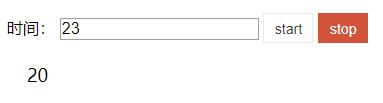
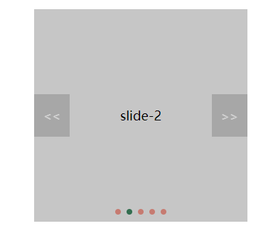

# custom components
A set of widgets based on javascript.
一套基于javascript的插件库 - 包含分页、倒计时、轮播等组件。

### 分页-原生js封装
简介：简单的分页操作
```javascript
new Pagination("selector",options);
```


### 倒计时-原生js封装
简介：倒计时，各种时间格式，可暂停/开始。
```javascript
new Countdown("selector",options);
```


### 轮播-原生js封装
简介：轮播插件，支持自动播放、间隔时间。缓冲时间、滑动方向、分页等扩展功能。
```javascript
new Carousel("selector",options);
```
